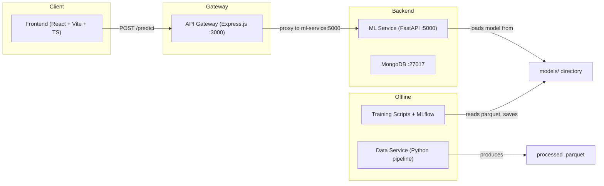
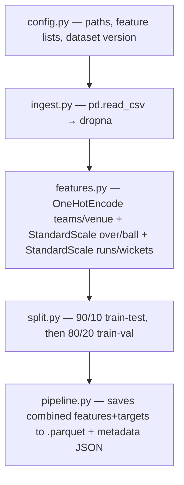
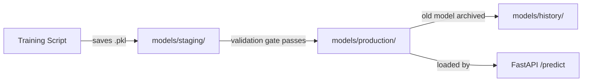

# IPL Prediction System — Full Codebase Walkthrough

A **microservices-based IPL match prediction platform** combining ML training pipelines, a FastAPI inference service, a Node.js API gateway, a React frontend, and Docker orchestration.

---

## High-Level Architecture



---

## 1. Original Data & Data Cleaning

| File | Purpose |
|------|---------|
| [matches.csv](file:///d:/IPL-Prediction-System/Original%20Data/matches.csv) | Match-level IPL data (225 KB) |
| [deliveries.csv](file:///d:/IPL-Prediction-System/Original%20Data/deliveries.csv) | Ball-by-ball data (27 MB) |
| [data_cleaning.ipynb](file:///d:/IPL-Prediction-System/Original%20Data/data_cleaning.ipynb) | Jupyter notebook that joins and cleans the above into [data1.csv](file:///d:/IPL-Prediction-System/Original%20Data/data1.csv) (~260K rows) |

The cleaned dataset has columns: `batting_team`, `bowling_team`, `venue`, `over`, `ball`, [runs](file:///d:/IPL-Prediction-System/ml-service/tests/test_inference.py#10-27), `wickets`, `winner`.

---

## 2. Data Service — ETL Pipeline

> **Location:** `data-service/` — a standalone Python pipeline that ingests raw CSV → engineers features → saves versioned `.parquet` files.

### Data flow (all orchestrated by [pipeline.py](file:///d:/IPL-Prediction-System/data-service/pipeline.py)):



| File | What it does |
|------|-------------|
| [config.py](file:///d:/IPL-Prediction-System/data-service/config.py) | Defines `DATASET_VERSION = "v2_alpha"`, file paths, and feature column lists |
| [ingest.py](file:///d:/IPL-Prediction-System/data-service/ingest.py) | Loads CSV, drops rows with null teams/venue |
| [features.py](file:///d:/IPL-Prediction-System/data-service/features.py) | One-hot encodes categorical features, standard-scales numerical X and Y |
| [split.py](file:///d:/IPL-Prediction-System/data-service/split.py) | Two-stage split → train (72%), val (18%), test (10%) |
| [metadata.py](file:///d:/IPL-Prediction-System/data-service/metadata.py) | Saves a JSON metadata file (version, row count, features, preprocessing steps) |
| [pipeline.py](file:///d:/IPL-Prediction-System/data-service/pipeline.py) | Orchestrates all of the above end-to-end |

**Output:** [ml-service/data/processed/v2_alpha/dataset.parquet](file:///d:/IPL-Prediction-System/ml-service/data/processed/v2_alpha/dataset.parquet) + [ml-service/data/metadata/v2_alpha.json](file:///d:/IPL-Prediction-System/ml-service/data/metadata/v2_alpha.json)

---

## 3. ML Service — The Core

> **Location:** `ml-service/` — contains model training, experiment tracking, model registry, inference API, and tests.

### 3.1 Training Scripts

````carousel
#### LSTM / GRU / RNN Training — [simple_train_test.py](file:///d:/IPL-Prediction-System/ml-service/training/simple_train_test.py)

1. Parses CLI `--config` arg → loads YAML config via `config_loader.py`
2. Reads the processed `.parquet` dataset, splits X/y columns
3. Reshapes X to 3D `(samples, 1, features)` for recurrent layers
4. Builds a `keras.Sequential` model: **Input → Recurrent1 → Recurrent2 → Dense → Dense → Output(2)**
5. Trains with Adam optimizer, logs all params/metrics to **MLflow** (SQLite backend)
6. Saves model as a pickled `IPLModelBundle` to `models/staging/`
7. Runs a **validation gate**: if `test_MAE < threshold` and `test_R² > threshold` → auto-promotes to production via `registry.py`

<!-- slide -->

#### Tree-Based Training — [simple_train_test_tree.py](file:///d:/IPL-Prediction-System/ml-service/training/simple_train_test_tree.py)

Same structure as above but supports **Decision Tree, Random Forest, and XGBoost** via a model factory function.
- Uses 2D flat input (no reshaping)
- Computes MAE, MSE, RMSE, R², Adjusted R²
- Same MLflow logging + validation gate + auto-promotion flow

<!-- slide -->

#### Baseline Comparison — [baselines.py](file:///d:/IPL-Prediction-System/ml-service/training/baselines.py)

Trains and evaluates **7 models** side-by-side:
- sklearn: Linear Regression, Decision Tree, Random Forest, XGBoost
- Keras: LSTM, GRU, SimpleRNN

Produces a **leaderboard** sorted by RMSE, including per-sample latency.

**Result:** XGBoost won with R² = 0.786 and 0.002ms latency (vs LSTM's 290ms).
````

### 3.2 Config Files

| Config | Model Type | Key Hyperparameters |
|--------|-----------|-------------------|
| [lstm_v1.yaml](file:///d:/IPL-Prediction-System/ml-service/configs/lstm_v1.yaml) | LSTM | 100/50 units, lr=0.004, 10 epochs, batch=1000 |
| [tree_v1.yaml](file:///d:/IPL-Prediction-System/ml-service/configs/tree_v1.yaml) | Decision Tree (swappable to RF/XGBoost) | max_depth=25, min_samples_split=15 |

Both configs define validation gates (MAE/R² thresholds) and path conventions.

### 3.3 Core Library (`ml-service/core/`)

| File | Purpose |
|------|---------|
| [config_loader.py](file:///d:/IPL-Prediction-System/ml-service/core/config_loader.py) | Loads YAML config with relative-path resolution |
| [logger.py](file:///d:/IPL-Prediction-System/ml-service/core/logger.py) | Sets up a rotating file + console logger (7-day retention, env-aware verbosity) |
| [model_bundle.py](file:///d:/IPL-Prediction-System/ml-service/core/model_bundle.py) | `IPLModelBundle` class — wraps a Keras/sklearn model with `preprocess()`, `predict()`, `info()`. Reshapes 2D input to 3D for LSTM. |
| [model_loader.py](file:///d:/IPL-Prediction-System/ml-service/core/model_loader.py) | Loads the production model by reading `current_model.txt` → unpickling the `.pkl` bundle + reading `metadata.json` |
| [registry.py](file:///d:/IPL-Prediction-System/ml-service/core/registry.py) | **Model promotion pipeline**: staging → production (moves old model to history, writes metadata) |

### 3.4 Model Lifecycle



### 3.5 FastAPI Inference App (`ml-service/app/`)

| File | Purpose |
|------|---------|
| [main.py](file:///d:/IPL-Prediction-System/ml-service/app/main.py) | FastAPI app with `/`, `/health`, and `/predict` (currently returns dummy data — router/model loading commented out) |
| [schema.py](file:///d:/IPL-Prediction-System/ml-service/app/schema.py) | Pydantic models: `PredictionRequest(teamA, teamB, venue, over, ball)` → `PredictionResponse(score, wickets)` |
| [routes.py](file:///d:/IPL-Prediction-System/ml-service/app/routes.py) | APIRouter with typed `/predict` endpoint (not yet wired) |
| [inference.py](file:///d:/IPL-Prediction-System/ml-service/app/inference.py) | Loads the production model and runs `model.predict()` on incoming data (not yet wired) |

### 3.6 Legacy Model — [model.py](file:///d:/IPL-Prediction-System/ml-service/training/model.py)

The **original monolithic Flask app** kept for reference. It does everything in one file:
- Loads CSV, fits encoders/scalers at module level
- Loads a pre-trained `lstm1.keras` model
- Flask `/api/predict` endpoint: encodes input → LSTM prediction → inverse-transforms → determines winner
- **Background re-training**: after each prediction, spawns a thread that appends the prediction as new training data and re-trains the LSTM

> [!WARNING]
> This file has missing imports (`Flask`, `CORS`, `request`, `jsonify`) — it won't run as-is. It is legacy code being replaced by the microservice architecture.

### 3.7 Tests (`ml-service/tests/`)

| Test | What it validates |
|------|------------------|
| [test_data_pipeline.py](file:///d:/IPL-Prediction-System/ml-service/tests/test_data_pipeline.py) | Dataset loads, has target columns, no nulls |
| [test_model_bundle.py](file:///d:/IPL-Prediction-System/ml-service/tests/test_model_bundle.py) | Bundle unpickles, has correct attributes and methods |
| [test_inference.py](file:///d:/IPL-Prediction-System/ml-service/tests/test_inference.py) | Production model runs prediction on dummy input |
| [test_registry.py](file:///d:/IPL-Prediction-System/ml-service/tests/test_registry.py) | Production model loads with valid metadata |

### 3.8 Experiment Tracking

MLflow stores runs in `experiments/mlruns.db` (SQLite). View with:
```bash
mlflow ui --backend-store-uri sqlite:///experiments/mlruns.db --port 5000
```

---

## 4. API Gateway (Node.js / Express)

> **Location:** `api-gateway/` — a thin proxy that sits between the frontend and the ML service.

| File | Purpose |
|------|---------|
| [server.js](file:///d:/IPL-Prediction-System/api-gateway/server.js) | Express app on port 3000 with JSON parsing, logging, auth middleware |
| [predict.js](file:///d:/IPL-Prediction-System/api-gateway/routes/predict.js) | `POST /predict` → proxies request to `http://ml-service:5000/predict` via axios |
| [logger.js](file:///d:/IPL-Prediction-System/api-gateway/middleware/logger.js) | Morgan HTTP request logger (`dev` format) |
| [auth.js](file:///d:/IPL-Prediction-System/api-gateway/middleware/auth.js) | Placeholder auth middleware (passes through, future JWT verification) |

---

## 5. Frontend (React + TypeScript + Vite + Tailwind)

> **Location:** `frontend/src/`

### Routing ([App.tsx](file:///d:/IPL-Prediction-System/frontend/src/App.tsx))

| Route | Page | Access |
|-------|------|--------|
| `/` | Home | Public |
| `/login` | Login | Public |
| `/register` | Register | Public |
| `/predictions` | Predictions | Authenticated users |
| `/statistics` | Statistics | Business role only |
| `/team-analysis` | Team Analysis | Business role only |

### Key Files

| File | Purpose |
|------|---------|
| [authStore.ts](file:///d:/IPL-Prediction-System/frontend/src/store/authStore.ts) | Zustand store managing `user`, `isAuthenticated`, `login()`, `logout()` — **client-side only, no backend** |
| [ProtectedRoute.tsx](file:///d:/IPL-Prediction-System/frontend/src/components/ProtectedRoute.tsx) | Route guard — redirects unauthenticated users; optionally requires `business` role |
| [Navbar.tsx](file:///d:/IPL-Prediction-System/frontend/src/components/Navbar.tsx) | Navigation bar — shows different links based on auth state and user role |
| [Predictions.tsx](file:///d:/IPL-Prediction-System/frontend/src/pages/Predictions.tsx) | Core prediction UI — dropdowns for Team 1, Team 2, Venue → calls `PredictionModel.predict()` → displays score/wickets/winner |
| [PredictionModel.ts](file:///d:/IPL-Prediction-System/frontend/src/utils/PredictionModel.ts) | API client — `POST` to `http://localhost:5000/api/predict` with `{teamA, teamB, venue}` |

> [!NOTE]
> The frontend currently calls the legacy Flask endpoint (`localhost:5000/api/predict`) directly. Once the API gateway is wired, it should call `localhost:3000/predict` instead.

---

## 6. Docker Compose — [docker-compose.yml](file:///d:/IPL-Prediction-System/docker-compose.yml)

Orchestrates three containers:

| Service | Port | Details |
|---------|------|---------|
| `api-gateway` | 3000 | Node.js Express proxy, depends on `ml-service` |
| `ml-service` | 5001→5000 | FastAPI, mounts `./models` volume |
| `mongo` | 27017 | MongoDB 6 with a persistent named volume (`mongo_data`) |

---

## 7. Documentation (`docs/`)

| Doc | Summary |
|-----|---------|
| [Goal.md](file:///d:/IPL-Prediction-System/docs/Goal.md) | Vision: production-grade cricket intelligence platform. Target: XGBoost-based, <1s latency, MLflow tracked, fully deployed |
| [Current_State.md](file:///d:/IPL-Prediction-System/docs/Current_State.md) | Baseline comparison results, known data issues, technical debt inventory |
| [roadmap.md](file:///d:/IPL-Prediction-System/docs/roadmap.md) | 6-phase plan (Weeks 1–8): Baseline ✅ → Training pipeline → Dataset v2 → Product layer → Advanced features → Deploy |
| [Project_Structure.md](file:///d:/IPL-Prediction-System/docs/Project_Structure.md) | File placement rules and conventions for contributors/AI assistants |

---

## 8. Current Status & What's Not Yet Working

| Area | Status |
|------|--------|
| Data pipeline (data-service) | ✅ Functional — produces versioned `.parquet` |
| Baseline benchmarking | ✅ Complete — XGBoost selected |
| Training with MLflow | ✅ Working for LSTM and tree models |
| Model registry (staging → production) | ✅ Implemented |
| FastAPI inference | ⚠️ Skeleton only — model loading/routes commented out |
| API Gateway | ⚠️ Proxy works but auth is placeholder |
| Frontend | ⚠️ UI exists but calls legacy Flask endpoint |
| Auth | ⚠️ Client-side only (Zustand), no backend JWT |
| Docker Compose | ⚠️ Defined but not tested end-to-end |
| CI/CD, monitoring, cloud deploy | 🔲 Not started |
